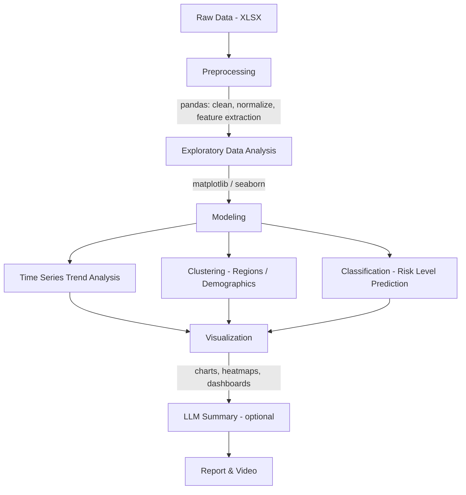

# AI for Substance Abuse Risk Detection from Social Signals

**CS 5542 Big Data Analytics and Applications - Lab 10**
**UMKC 2026 Spring Research-A-Thon - NSF NRT AI Challenge**

---

## Team Members

- **Kenneth** - Data Engineering & Modeling
- **Ron** - Video Production & Submission
- **Blake Simpson** - Report, Visualization & GitHub

---

## Problem Statement

Substance abuse remains a major public health crisis in the United States. This project applies AI and machine learning techniques to publicly available CDC overdose data to detect trends, identify risk signals, and uncover demographic and geographic patterns in substance abuse. The goal is to produce interpretable, population-level insights that could inform public health intervention strategies.

---

## Datasets

| Dataset | Source | Description |
|---|---|---|
| Fatal Overdose Data | [CDC SUDORS Dashboard](https://www.cdc.gov/overdose-prevention/data-research/facts-stats/sudors-dashboard-fatal-overdose-data-accessible.html) | Fatal overdose statistics from the State Unintentional Drug Overdose Reporting System |
| Non-Fatal Overdose Data | [CDC DOSE Dashboard](https://www.cdc.gov/overdose-prevention/data-research/facts-stats/dose-dashboard-nonfatal-discharge-data.html) | Non-fatal overdose emergency department discharge data |
| Florida Post-Overdose Drug Data | [FDLE MEC Publications](https://www.fdle.state.fl.us/MEC/Publications-and-Forms) | Drugs found in system post-overdose (supplementary) |
| Substance Use by Demographic | [Monitoring the Future (Panel)](https://monitoringthefuture.org/data/panel/) | Longitudinal substance use survey data (supplementary) |
| Alcohol Use Rate (High Schoolers) | [Monitoring the Future (Prevalence)](https://monitoringthefuture.org/data/bx-by/drug-prevalence/#drug="") | Youth alcohol use prevalence data (supplementary) |

**Primary datasets**: CDC Fatal and Non-Fatal Overdose data. Others are supplementary.

---

## Methods

### Core Tasks

1. **Temporal & Behavioral Analysis** - Time series trend analysis on overdose rates to identify spikes, seasonal patterns, and year-over-year changes
2. **Risk Signal Detection** - Identify high-risk demographics, substances, and geographic regions
3. **Explainability & Reasoning** - Interpretable visualizations and evidence-based summaries of findings

### Techniques

- Time series analysis on overdose rates
- Clustering (K-Means / DBSCAN) to group regions or demographics by risk level
- Classification for risk level prediction
- Data visualization (trend charts, heatmaps, demographic breakdowns)
- LLM-based summarization for generating interpretable narratives (optional)

---

## Technical Pipeline



---

## Project Structure

```
lab_10/
├── README.md
├── LAB_10_PLAN.md
├── requirements.txt
├── .gitignore
├── data/
│   ├── README.md         # Download links and instructions for datasets
│   ├── raw/              # Original XLSX files (gitignored)
│   └── processed/        # Cleaned CSVs (gitignored)
├── notebooks/            # Jupyter notebooks for EDA and modeling
├── src/                  # Source code for the pipeline
├── visualizations/       # Saved charts and figures for the report
└── report/               # 4-page project report
```

---

## Getting Started

### Prerequisites

- Python 3.9+
- pip

### Installation

```bash
git clone https://github.com/<your-username>/lab_10.git
cd lab_10
pip install -r requirements.txt
```

### Running the Project

1. **Download the datasets** - See [`data/README.md`](data/README.md) for download links and expected filenames. Place raw files in `data/raw/`.
2. **Run preprocessing and EDA**:
   ```bash
   jupyter notebook notebooks/
   ```
3. **Run the ML pipeline**:
   ```bash
   python src/main.py
   ```
4. **View results** - Generated visualizations will be saved to the `visualizations/` directory.

---

## Ethical Considerations

- All analysis is performed at the **population level** - no attempt is made to identify real individuals
- Only **publicly available, approved datasets** are used
- The project focuses on **responsible AI practices** and transparent methodology
- Results are presented with appropriate context and limitations

---

## Deliverables

- [4-Page Report](report/)
- [3-Minute Video](#) *(link TBD)*
- This GitHub Repository

---

## Acknowledgments

This project was completed as part of the NSF NRT AI Challenge at the UMKC 2026 Spring Research-A-Thon.

- **Course**: CS 5542 Big Data Analytics and Applications
- **Event**: [UMKC Research-A-Thon 2026](https://sites.google.com/view/research-a-thon-2026/home)
- **Challenge**: NRT Challenge 1 - AI for Substance Abuse Risk Detection from Social Signals
