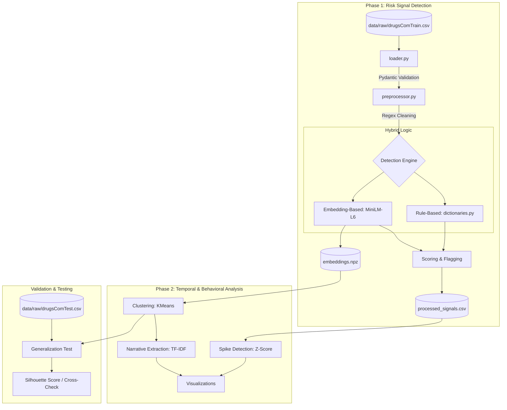

```markdown
# Digital Sentinels: AI-Driven Risk Signal Detection for Substance Abuse

## Executive Summary
Substance abuse is a critical public health crisis. Often, there is a significant lag between community-level behavioral shifts and official medical reporting. Early warning signals frequently emerge in digital environments—such as medical review forums—before manifesting in clinical data. 

**Digital Sentinels** is an AI-driven pipeline designed to identify risk signals related to alcohol and drug dependency from public, anonymized data. By transforming unstructured, noisy text into actionable insights, this system supports early public health awareness and intervention. 

The project is divided into two core phases:
1. **Risk Signal Detection:** A scalable NLP pipeline extracting relevant textual signals (substance mentions, emotional distress, relapse indicators).
2. **Temporal and Behavioral Analysis:** Modeling the dynamics of these signals to detect anomalies (spikes) and clustering reviews to uncover evolving behavioral narratives.

---

## Dataset
This project utilizes a single dataset for its analysis. 
* **Source:** [UCI KUC Hackathon Winter 2018 (Drug Reviews)](https://www.kaggle.com/datasets/jessicali9530/kuc-hackathon-winter-2018)

**Setup:** Download the dataset from the link above and place the raw CSV files into the `data/raw/` directory before running the pipeline.

---

## Code Architecture & Data Flow

The system is designed with a modular, Pipe-and-Filter architecture to prioritize computational efficiency and data integrity.

### Phase 1: Risk Signal Detection (Batch Processing)
```text
[Raw CSV] -> loader.py -> preprocessor.py -> detection_engine -> [Processed CSV & Embeddings]
```
* **`schemas.py` (Data Contracts):** Enforces rigid Pydantic models at every stage to prevent pipeline failures from malformed real-world data.
* **`loader.py` (Ingestion):** Handles memory management by streaming the massive CSV in manageable batches.
* **`preprocessor.py` (Normalization):** Uses compiled regular expressions to rapidly strip HTML artifacts and special characters.
* **`dictionaries.py` & Engine:** Combines a Rule-Based Baseline (regex matching for clinical/slang terms) with a Semantic Embedding Model (`all-MiniLM-L6-v2`) to detect nuanced psychological distress locally without LLM API costs or latency.

### Phase 2: Temporal & Behavioral Analysis
```text
[Processed CSV & Embeddings] -> processing_results.ipynb -> KMeans & TF-IDF -> [Visualizations & Insights]
```
* **Spike Detection:** Uses pandas resampling to identify when a drug's risk score statistically deviates from its historical baseline.
* **Behavioral Clustering:** Applies K-Means clustering to the semantic embeddings to group mathematically similar distress vectors.
* **Narrative Extraction:** Utilizes TF-IDF to translate abstract mathematical clusters back into human-readable Evolving Narratives.

---

## Installation & Setup

Ensure you have Python 3.8+ installed. 

1. **Clone the repository and navigate to the project root.**
2. **Set up the virtual environment and install dependencies:**
   ```bash
   python -m venv .venv
   
   # For Windows:
   .venv\Scripts\activate
   # For macOS/Linux:
   # source .venv/bin/activate
   
   pip install -r requirements.txt
   ```

---

## Execution Guide

### 1. Preprocessing and Signal Detection
Run the main Python script to ingest the raw data, clean the text, run the detection engine, and generate the vector embeddings.

```bash
python main.py
```
> **⚠️ Disclaimer:** Depending on your local hardware, generating semantic embeddings for the entire dataset takes time. Expect this step to take **30 to 40 minutes**.

### 2. Processing, Clustering, and Visualization
Once `main.py` finishes, the structured signals and `.npz` embeddings will be saved. You can now extract insights and generate visual reports.

* Open and run all cells in **`processing_results.ipynb`**.
* This notebook executes the Phase 2 analysis, including Silhouette Score validation and TF-IDF keyword extraction.
* All resulting charts, temporal spike graphs, and heatmaps are automatically saved to the **`/visualizations`** folder.

---

## Key Findings & Discovered Narratives

The Phase 2 clustering successfully isolated structural patterns in how different substances correlate with specific types of distress, validating the system's ability to extract interpretable insights:

* **Cluster 0 (Mental Health & Psychological Distress):** * *Keywords:* anxiety, withdrawal, suicidal, depression, thoughts. 
  * *Insight:* Captures the severe psychiatric toll of dependency or rapid cessation of neuro-active medications (Benzodiazepines, SSRIs).
* **Cluster 1 (Physical Dependency & Pain Management):** * *Keywords:* pain, withdrawal, months, years, effects. 
  * *Insight:* The classic signature of chronic pain patients struggling with opioid dependency, highlighting long-term users facing diminishing returns and physical withdrawal.
* **Cluster 2 (Semantic False Positive - Side Effects):** * *Keywords:* weight, lost, cravings, eat, started. 
  * *Insight:* Successfully isolated a semantic collision where "cravings" related to food/weight-loss drugs rather than chemical dependency, keeping the abuse-focused clusters clean.
* **Cluster 3 (Medication-Assisted Treatment & Recovery):** * *Keywords:* suboxone, methadone, day, years, life. 
  * *Insight:* Shifts away from active abuse toward recovery, with users documenting sobriety journeys and the complexities of tapering off MAT drugs.


## Data flow


```