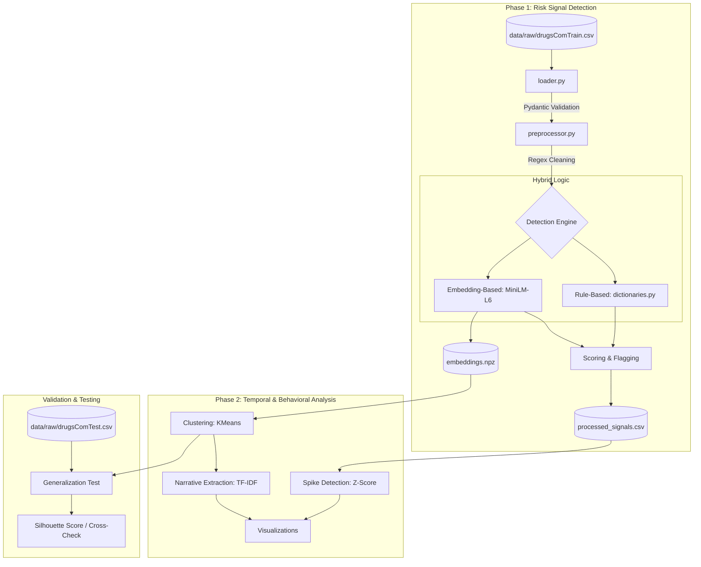

```mermaid
graph TD
    subgraph Phase_1_Detection ["Phase 1: Risk Signal Detection"]
        A[(data/raw/drugsComTrain.csv)] --> B[loader.py]
        B -->|Pydantic Validation| C[preprocessor.py]
        C -->|Regex Cleaning| D{Detection Engine}
        
        subgraph Engine_Logic ["Hybrid Logic"]
            D --> E[Rule-Based: dictionaries.py]
            D --> F[Embedding-Based: MiniLM-L6]
        end
        
        E --> G[Scoring & Flagging]
        F --> G
        G --> H[(processed_signals.csv)]
        F --> I[(embeddings.npz)]
    end

    subgraph Phase_2_Analysis ["Phase 2: Temporal & Behavioral Analysis"]
        H --> J[Spike Detection: Z-Score]
        I --> K[Clustering: KMeans]
        K --> L[Narrative Extraction: TF-IDF]
        J --> M[Visualizations]
        L --> M
    end

    subgraph Validation ["Validation & Testing"]
        N[(data/raw/drugsComTest.csv)] --> O[Generalization Test]
        K --> O
        O --> P[Silhouette Score / Cross-Check]
    end
```
